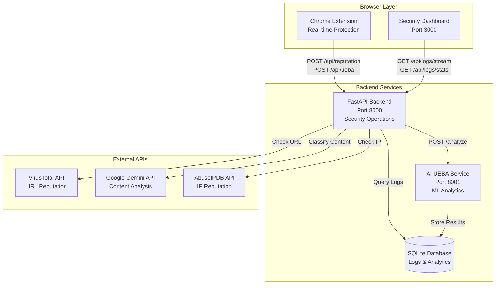
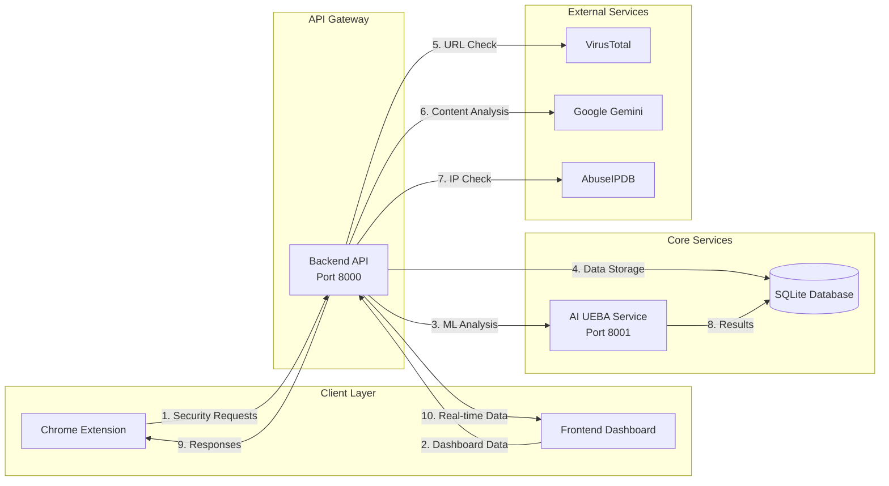
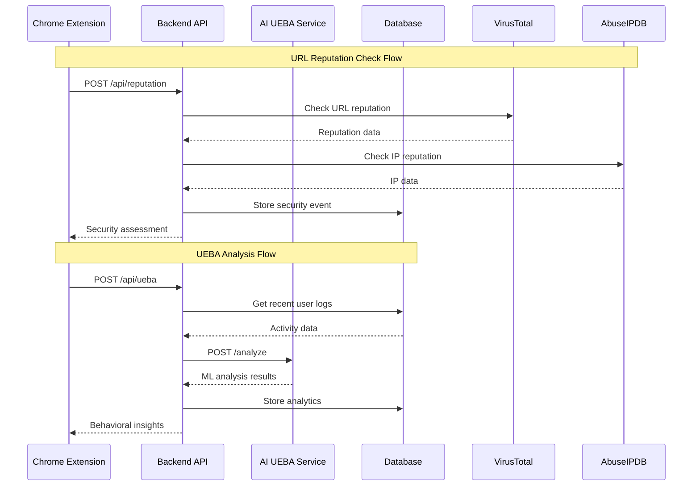
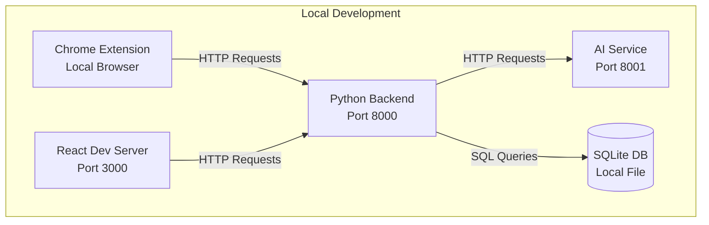
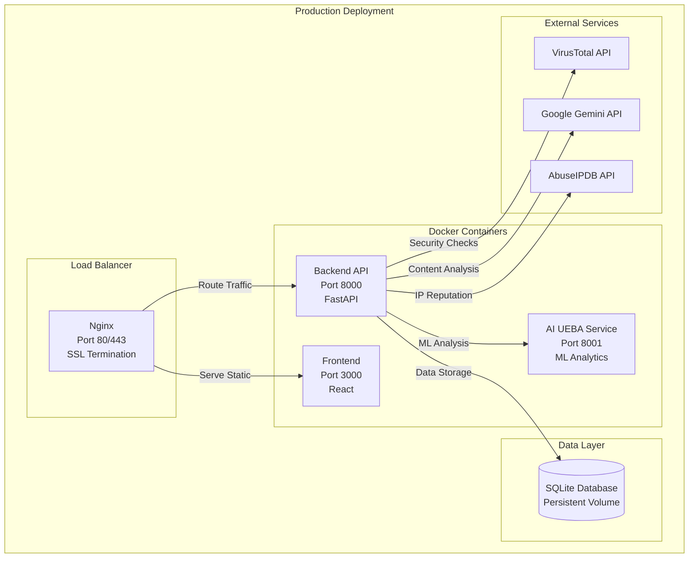
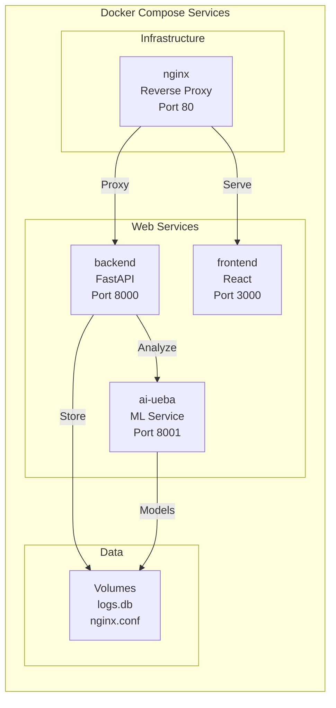

# 🏗️ InspyGuard Architecture

## System Overview

InspyGuard is a multi-layered security platform consisting of:

1. **Chrome Extension** - Real-time browser protection
2. **Backend API** - Security operations and data processing
3. **AI UEBA Service** - Machine learning analytics
4. **Frontend Dashboard** - Security monitoring interface
5. **External APIs** - Third-party security services

## Detailed Component Architecture

### Chrome Extension
- **Content Scripts**: Monitor page activity and file uploads
- **Background Scripts**: Handle URL reputation checking
- **Service Worker**: Persistent security monitoring
- **Popup Interface**: User controls and status

### Backend API (FastAPI) - Port 8000

#### Core Endpoints

| Method | Endpoint | Description | Request/Response |
|--------|----------|-------------|------------------|
| `GET` | `/` | Health check | `{"message": "Inspy Security Backend API", "version": "1.0.0"}` |
| `POST` | `/api/reputation` | URL reputation check | `{"url": "string"} → {"malicious": bool, "score": int, "sources": object}` |
| `POST` | `/api/gpt/classify` | Content classification | `{"text": "string"} → {"label": "string", "reason": "string"}` |
| `POST` | `/api/ueba` | User behavior analytics | `{"url": "string"} → {"total_time_on_page": float, "avg_time_on_page": float, "anomaly_score": float, "anomaly_flag": int, "suspicious_count": int}` |

#### Log Management Endpoints

| Method | Endpoint | Description | Parameters |
|--------|----------|-------------|------------|
| `GET` | `/api/logs` | Get paginated logs | `page`, `per_page` |
| `POST` | `/api/logs` | Create log entry | `{"url": "string", "timestamp": "datetime", "type": "string", "reason": "string"}` |
| `GET` | `/api/logs/stats` | Get log statistics | - |
| `DELETE` | `/api/logs/{log_id}` | Delete specific log | `log_id` |
| `DELETE` | `/api/logs` | Clear all logs | - |
| `GET` | `/api/logs/stream` | Real-time log stream | `page`, `per_page`, `log_type`, `reason`, `start_date`, `end_date` |

#### MCP Logs Endpoints

| Method | Endpoint | Description | Parameters |
|--------|----------|-------------|------------|
| `GET` | `/api/mcp-logs` | Get MCP logs | `page`, `per_page` |

#### Utility Endpoints

| Method | Endpoint | Description |
|--------|----------|-------------|
| `GET` | `/api/logs/filter-options` | Get available filter options |

### AI UEBA Service - Port 8001

#### Core Endpoints

| Method | Endpoint | Description | Request/Response |
|--------|----------|-------------|------------------|
| `GET` | `/` | Service info | `{"message": "AI UEBA Service", "version": "1.0.0"}` |
| `GET` | `/health` | Health check | `{"status": "healthy", "service": "ai-ueba"}` |
| `POST` | `/analyze` | Full behavior analysis | `{"logs": [LogEntry]} → {"anomaly_flag": int, "predicted_uninstall": int, "uninstall_prob": float, "session_duration_ms": float, "num_events": int, "error_rate": float}` |
| `POST` | `/analyze-simple` | Simplified analysis | `{"logs": [LogEntry]} → {"anomaly_flag": int, "predicted_uninstall": int, "uninstall_prob": float}` |

#### Data Models

**LogEntry Model:**
```json
{
  "id": "integer",
  "url": "string",
  "timestamp": "string (ISO format)",
  "type": "string (normal|malicious|suspicious)",
  "reason": "string"
}
```

**UEBA Response Model:**
```json
{
  "total_time_on_page": "float (seconds)",
  "avg_time_on_page": "float (seconds)",
  "anomaly_score": "float (0.0-1.0)",
  "anomaly_flag": "integer (0|1)",
  "suspicious_count": "integer"
}
```

### Frontend Dashboard (React) - Port 3000

#### Components Architecture

| Component | Purpose | API Integration |
|-----------|---------|-----------------|
| `Dashboard.tsx` | Main dashboard view | `/api/logs/stream` (SSE) |
| `LogTable.tsx` | Log display and filtering | `/api/logs`, `/api/logs/filter-options` |
| `StatsCard.tsx` | Statistics display | `/api/logs/stats` |
| `LogsFilter.tsx` | Advanced filtering | `/api/logs/filter-options` |
| `LogsPagination.tsx` | Pagination controls | `/api/logs` |
| `Navbar.tsx` | Navigation and theme | - |
| `ThemeToggle.tsx` | Dark/light mode | - |

#### Real-time Features
- **Server-Sent Events**: Live log updates via `/api/logs/stream`
- **Auto-refresh**: Automatic data refresh every 10 seconds
- **Filtering**: Real-time filter application
- **Export**: CSV/JSON export functionality

## System Architecture Overview



## Detailed Data Flow Architecture



## Service Communication Flow



## API Request/Response Flow

### URL Reputation Check Flow

```
1. Chrome Extension → POST /api/reputation
   Request: {"url": "https://example.com"}
   
2. Backend API → VirusTotal API
   GET https://www.virustotal.com/api/v3/urls/{encoded_url}
   
3. Backend API → AbuseIPDB API  
   GET https://api.abuseipdb.com/api/v2/check?ipAddress={ip}
   
4. Backend API → Chrome Extension
   Response: {
     "malicious": false,
     "score": 0,
     "sources": {
       "virustotal": {...},
       "abuseipdb": {...}
     }
   }
```

### UEBA Analysis Flow

```
1. Chrome Extension → POST /api/ueba
   Request: {"url": "https://example.com"}
   
2. Backend API → GET recent logs from database
   Query: SELECT * FROM logs ORDER BY timestamp DESC LIMIT 10
   
3. Backend API → POST /analyze (AI Service)
   Request: {"logs": [LogEntry, ...]}
   
4. AI Service → ML Analysis
   - Extract features (session_duration, num_events, error_rate)
   - Run anomaly detection model
   - Calculate risk scores
   
5. AI Service → Backend API
   Response: {
     "anomaly_flag": 0,
     "predicted_uninstall": 0,
     "uninstall_prob": 0.1,
     "session_duration_ms": 240000.0,
     "num_events": 3,
     "error_rate": 0.333
   }
   
6. Backend API → Field Mapping
   - session_duration_ms → total_time_on_page (÷1000)
   - num_events + total_time_on_page → avg_time_on_page
   - error_rate × num_events → suspicious_count
   - uninstall_prob → anomaly_score
   
7. Backend API → Chrome Extension
   Response: {
     "total_time_on_page": 240.0,
     "avg_time_on_page": 80.0,
     "anomaly_score": 0.1,
     "anomaly_flag": 0,
     "suspicious_count": 1
   }
```

### Real-time Log Streaming Flow

```
1. Frontend Dashboard → GET /api/logs/stream
   Query: ?page=1&per_page=20&log_type=all
   
2. Backend API → Server-Sent Events
   Content-Type: text/event-stream
   
3. Backend API → Database Query (every 10s)
   SELECT * FROM logs ORDER BY timestamp DESC LIMIT 20
   
4. Backend API → Frontend Dashboard
   data: {"type": "logs", "logs": [...], "pagination": {...}}
   
5. Frontend Dashboard → React State Update
   - Update logs table
   - Update pagination
   - Trigger re-render
```

## Security Features

### URL Protection
- **Real-time reputation checking**: VirusTotal + AbuseIPDB integration
- **Multi-source validation**: OR logic (either service can flag)
- **Cached results**: 5-minute cache for performance
- **Automatic blocking**: Custom blocking page with details
- **Trusted domains**: Whitelist for known safe domains

### File Security
- **Extension-based upload blocking**: Intercepts file uploads
- **Dangerous file type detection**: .exe, .dll, .bat, .scr, etc.
- **Size limit enforcement**: Blocks files >10MB
- **Real-time scanning**: Immediate detection during upload

### Content Analysis
- **AI-powered classification**: Google Gemini for intelligent analysis
- **Sensitive data detection**: Regex patterns for API keys, SSNs, credit cards
- **Automatic content blocking**: Prevents malicious paste content
- **Rate limiting**: Prevents API abuse

### Behavioral Analytics (UEBA)
- **User behavior monitoring**: Tracks browsing patterns
- **Anomaly detection**: ML-based threat identification
- **Risk scoring**: Probability-based assessment (0.0-1.0)
- **Threat prediction**: Proactive security measures

## Technology Stack

| Component | Technology | Version | Purpose |
|-----------|------------|---------|---------|
| **Backend** | FastAPI, Python | 3.8+ | API server and business logic |
| **AI Service** | Python, scikit-learn | Latest | Machine learning analytics |
| **Frontend** | React, TypeScript | 18+ | User interface |
| **Database** | SQLite | 3.x | Data storage |
| **Extension** | JavaScript, Chrome APIs | Manifest V3 | Browser integration |
| **External** | REST APIs | - | Third-party services |
| **Container** | Docker, Docker Compose | Latest | Deployment |

## Database Schema

### Logs Table
```sql
CREATE TABLE logs (
    id INTEGER PRIMARY KEY AUTOINCREMENT,
    url TEXT NOT NULL,
    timestamp DATETIME NOT NULL,
    type TEXT NOT NULL,  -- 'normal', 'malicious', 'suspicious'
    reason TEXT NOT NULL
);
```

### MCP Logs Table
```sql
CREATE TABLE mcp_logs (
    id INTEGER PRIMARY KEY AUTOINCREMENT,
    timestamp DATETIME,
    level TEXT,
    message TEXT,
    command TEXT,
    tool TEXT,
    target TEXT,
    log_source TEXT DEFAULT 'mcp'
);
```

## Deployment Architecture

### Development Environment



### Production Environment



### Docker Services Architecture



### Docker Services

| Service | Image | Port | Environment | Health Check |
|---------|-------|------|-------------|--------------|
| `backend` | Custom FastAPI | 8000 | VT_API_KEY, GEMINI_API_KEY, ABUSEIPDB_API_KEY | `/` |
| `ai-ueba` | Custom ML Service | 8001 | PYTHONUNBUFFERED=1 | `/health` |
| `frontend` | Custom React | 3000 | - | `/` |
| `nginx` | Nginx Alpine | 80 | - | `/` |

## Security Considerations

### API Security
- **API Key Management**: Secure environment variable storage
- **CORS Configuration**: Controlled cross-origin access
- **Rate Limiting**: API abuse prevention (4/min VirusTotal, 15/min Gemini)
- **Input Validation**: Request sanitization and validation
- **Error Handling**: Secure error responses without sensitive data

### Data Privacy
- **Sensitive Information Redaction**: API keys, SSNs, credit cards
- **HTTPS**: Encrypted communication in production
- **Database Security**: SQLite with proper access controls
- **Log Sanitization**: Remove sensitive data from logs

### Network Security
- **Firewall Rules**: Restrict access to necessary ports only
- **SSL/TLS**: Encrypt all communications
- **API Authentication**: Implement proper authentication (future)
- **Monitoring**: Log all security events and API calls

## Performance Optimizations

### Caching Strategy
- **URL Reputation Cache**: 5-minute cache for repeated checks
- **Database Query Optimization**: Indexed queries for fast retrieval
- **Connection Pooling**: Efficient HTTP client usage
- **Static Asset Caching**: Frontend assets cached by browser

### Scalability Considerations
- **Horizontal Scaling**: Multiple backend instances behind load balancer
- **Database Scaling**: Consider PostgreSQL for high-volume production
- **CDN Integration**: Static assets served via CDN
- **Microservices**: Separate services for different functionalities

## Monitoring & Logging

### Health Monitoring
- **Service Health Checks**: Automated health check endpoints
- **Uptime Monitoring**: External monitoring services
- **Performance Metrics**: Response time and throughput monitoring
- **Error Tracking**: Comprehensive error logging and alerting

### Security Monitoring
- **Threat Detection**: Real-time security event monitoring
- **Anomaly Alerts**: ML-based anomaly detection alerts
- **API Usage Monitoring**: Track API usage and rate limits
- **Audit Logging**: Complete audit trail of all security events
