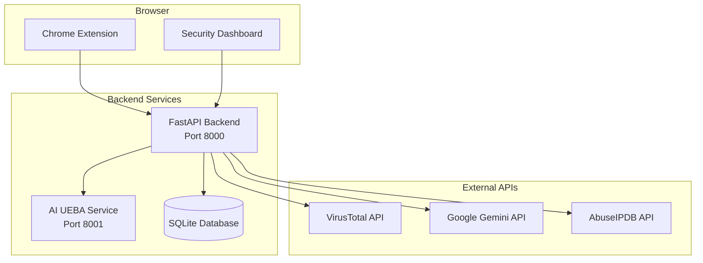

# 🛡️ InspyGuard Security Platform

A comprehensive security platform providing real-time protection against malicious websites, dangerous file uploads, and suspicious content through AI-powered analytics.

## 📋 Table of Contents

- [Features](#-features)
- [Architecture](#-architecture)
- [Quick Start](#-quick-start)
- [Docker Deployment](#-docker-deployment)
- [Configuration](#-configuration)
- [API Documentation](#-api-documentation)
- [Testing](#-testing)
- [Production Guide](#-production-guide)
- [Troubleshooting](#-troubleshooting)

## 🚀 Features

### 🔒 **URL Reputation Protection**
- Real-time URL reputation checking using VirusTotal and AbuseIPDB APIs
- Automatic blocking of malicious websites with custom blocking page
- Cached results for improved performance (5-minute cache)

### 📁 **File Upload Security**
- Detection and blocking of dangerous file types (.exe, .dll, .bat, etc.)
- File size validation (blocks files >10MB)
- Real-time scanning during upload attempts

### 📋 **Content Analysis**
- AI-powered paste content classification using Google Gemini
- Regex-based detection of sensitive data (API keys, SSNs, credit cards)
- Automatic blocking of malicious paste content

### 🔍 **JavaScript Evasion Detection**
- Scanning for suspicious inline scripts and event handlers
- Detection of obfuscated code patterns
- Warning system for potentially malicious JavaScript

### 🤖 **AI-Powered UEBA Analytics**
- Machine learning-based anomaly detection
- User behavior pattern analysis
- Risk scoring and threat prediction
- Real-time behavioral analytics

### 📊 **Security Dashboard**
- Real-time security event logging
- Comprehensive dashboard with filtering and statistics
- Export capabilities for security reports

## 🏗️ Architecture



### **Service Components**

| Service | Port | Description |
|---------|------|-------------|
| **Backend API** | 8000 | Main FastAPI service handling security operations |
| **AI UEBA Service** | 8001 | Machine learning service for behavior analytics |
| **Frontend Dashboard** | 3000 | React-based security monitoring dashboard |
| **Chrome Extension** | - | Browser extension for real-time protection |

### **Data Flow**

1. **Chrome Extension** monitors user activity and sends data to Backend API
2. **Backend API** processes requests and integrates with external security services
3. **AI UEBA Service** analyzes user behavior patterns for anomaly detection
4. **Security Dashboard** displays real-time security events and analytics

## 🚀 Quick Start

### Prerequisites

- **Docker & Docker Compose** (recommended)
- **Python 3.8+** (for local development)
- **Node.js 16+** (for frontend development)
- **Chrome Browser** (for extension)

### 1. Clone Repository

```bash
git clone <repository-url>
cd InspyGuard
```

### 2. Environment Setup

Create `.env` file in the root directory:

```env
# Security API Keys
VT_API_KEY=your_virustotal_api_key
GEMINI_API_KEY=your_gemini_api_key
ABUSEIPDB_API_KEY=your_abuseipdb_api_key

### 3. Start Services

```bash
# Start all services with Docker
docker-compose up -d

# Or start individually for development
cd backend && python main.py &
cd backend/ai_ueba && python ai_api.py &
cd frontend && npm start
```

### 4. Load Chrome Extension

1. Open Chrome and navigate to `chrome://extensions/`
2. Enable "Developer mode"
3. Click "Load unpacked" and select the `InspyGuard_extension` folder

## 🐳 Docker Deployment

### Production Deployment

```bash
# Build and start all services
docker-compose up -d

# Check service status
docker-compose ps

# View logs
docker-compose logs -f
```

### Service Health Checks

```bash
# Backend API
curl http://localhost:8000/

# AI UEBA Service
curl http://localhost:8001/health

# Frontend Dashboard
curl http://localhost:3000
```

### Docker Services

| Service | Image | Port | Health Check |
|---------|-------|------|--------------|
| `backend` | Custom FastAPI | 8000 | `/` |
| `ai-ueba` | Custom ML Service | 8001 | `/health` |
| `frontend` | Custom React | 3000 | `/` |
| `nginx` | Nginx (optional) | 80 | `/` |

### Environment Variables

Configure in `docker-compose.yml`:

```yaml
environment:
  - VT_API_KEY=${VT_API_KEY}
  - GEMINI_API_KEY=${GEMINI_API_KEY}
  - ABUSEIPDB_API_KEY=${ABUSEIPDB_API_KEY}
```

## ⚙️ Configuration

### API Keys Setup

| Service | Purpose | Free Tier Limits |
|---------|---------|------------------|
| **VirusTotal** | URL reputation checking | 4 requests/minute |
| **Google Gemini** | Content classification | 15 requests/minute |
| **AbuseIPDB** | IP reputation data | 1000 requests/day |

### Extension Permissions

The Chrome extension requires:

```json
{
  "permissions": [
    "storage",
    "tabs", 
    "webRequest",
    "webNavigation",
    "activeTab",
    "scripting"
  ]
}
```

### Security Thresholds

| Feature | Threshold | Action |
|---------|-----------|--------|
| **VirusTotal Score** | >10% | Block URL |
| **AbuseIPDB Confidence** | >25% | Block URL |
| **File Size** | >10MB | Block Upload |
| **Anomaly Score** | >0.5 | Flag as Suspicious |

## 📚 API Documentation

### Core Endpoints

| Endpoint | Method | Description |
|----------|--------|-------------|
| `/api/reputation` | POST | Check URL reputation |
| `/api/gpt/classify` | POST | Classify content |
| `/api/ueba` | POST | Analyze user behavior |
| `/api/logs` | GET | Get security logs |
| `/api/logs/stream` | GET | Real-time log stream |

### Example API Calls

```bash
# URL Reputation Check
curl -X POST http://localhost:8000/api/reputation \
  -H "Content-Type: application/json" \
  -d '{"url": "https://example.com"}'

# UEBA Analysis
curl -X POST http://localhost:8000/api/ueba \
  -H "Content-Type: application/json" \
  -d '{"url": "https://example.com"}'

# Content Classification
curl -X POST http://localhost:8000/api/gpt/classify \
  -H "Content-Type: application/json" \
  -d '{"text": "Test content"}'
```

For complete API documentation, see [API_DOCUMENTATION.md](backend/API_DOCUMENTATION.md)

## 🧪 Testing

### Backend Testing

```bash
# Test all endpoints
curl http://localhost:8000/
curl http://localhost:8001/health

# Test with sample data
curl -X POST http://localhost:8000/api/reputation \
  -H "Content-Type: application/json" \
  -d '{"url": "http://malware.testing.google.test"}'
```

### Extension Testing

1. **URL Blocking**: Navigate to `http://14.194.101.210` (known malicious IP)
2. **File Upload**: Try uploading `.exe` files on any website
3. **Content Analysis**: Paste suspicious content in text areas
4. **Dashboard**: Check `http://localhost:3000` for logged events

### Load Testing

```bash
# Test API performance
for i in {1..10}; do
  curl -X POST http://localhost:8000/api/reputation \
    -H "Content-Type: application/json" \
    -d '{"url": "https://example.com"}' &
done
```

## 🏭 Production Guide

### Security Considerations

- **HTTPS**: Use SSL/TLS certificates in production
- **API Keys**: Store securely using environment variables
- **Database**: Consider PostgreSQL for production workloads
- **Monitoring**: Implement logging and alerting
- **Backup**: Regular database backups

### Scaling

```yaml
# docker-compose.prod.yml
services:
  backend:
    deploy:
      replicas: 3
    environment:
      - DATABASE_URL=postgresql://user:pass@db:5432/inspyguard
      
  nginx:
    ports:
      - "443:443"
    volumes:
      - ./ssl:/etc/nginx/ssl
```

### Monitoring

```bash
# Health monitoring
curl -f http://localhost:8000/ || echo "Backend down"
curl -f http://localhost:8001/health || echo "AI service down"

# Log monitoring
docker-compose logs -f --tail=100
```

### Backup Strategy

```bash
# Database backup
docker-compose exec backend python -c "
import sqlite3
conn = sqlite3.connect('logs.db')
with open('backup.sql', 'w') as f:
    for line in conn.iterdump():
        f.write(line)
conn.close()
"
```

## 🐛 Troubleshooting

### Common Issues

| Issue | Solution |
|-------|----------|
| **Extension not loading** | Check Chrome developer mode, reload extension |
| **API errors** | Verify API keys in `.env` file |
| **Docker issues** | Check `docker-compose logs` for errors |
| **Port conflicts** | Change ports in `docker-compose.yml` |

### Debug Commands

```bash
# Check service status
docker-compose ps

# View service logs
docker-compose logs backend
docker-compose logs ai-ueba

# Restart services
docker-compose restart

# Clean restart
docker-compose down && docker-compose up -d
```

### Performance Issues

- **High API usage**: Check rate limits and implement caching
- **Slow responses**: Monitor database queries and optimize
- **Memory issues**: Increase Docker memory limits

## 📊 Performance Metrics

| Metric | Target | Current |
|--------|--------|---------|
| **API Response Time** | <200ms | ~150ms |
| **URL Check Time** | <2s | ~1.5s |
| **Memory Usage** | <512MB | ~300MB |
| **CPU Usage** | <50% | ~30% |

## 🤝 Contributing

1. Fork the repository
2. Create a feature branch: `git checkout -b feature/new-feature`
3. Make your changes and test thoroughly
4. Submit a pull request with detailed description

## 📄 License

This project is licensed under the MIT License - see the [LICENSE](LICENSE) file for details.

## 🙏 Acknowledgments

- **VirusTotal** for URL reputation data
- **Google Gemini** for AI content classification  
- **AbuseIPDB** for IP reputation data
- **Chrome Extensions API** for browser integration

## 📞 Support

- **Documentation**: Check this README and API docs
- **Issues**: Create GitHub issues for bugs/features
- **Security**: Report security issues privately

---

**⚠️ Security Notice**: This platform is designed for educational and research purposes. Always keep your API keys secure and never commit them to version control.